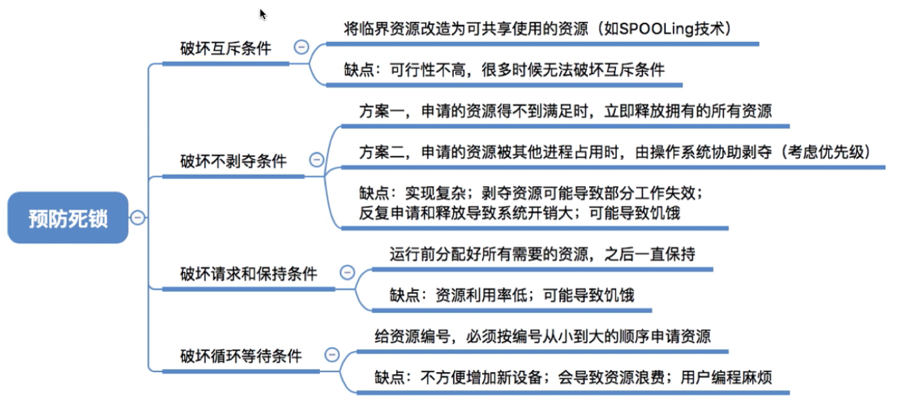

# 死锁

## 原理

### 定义

> 死锁定义为一组**相互竞争系统资源或进行通信**的进程间的“**永久**”阻塞。当一组进程中的每个进程都在等待某个事件（典型情况下是等待释放所有请求的资源），而仅有这组进程中被阻塞的其他进程才可触发该事件时，就称这组进程发生了死锁。因为没有事件能够被触发，故死锁是永久性的。与并发进程管理中的其他问题不同，死锁问题并无有效的通用解决方案。         ——《操作系统：精髓与设计原理》P164

简单地说：死锁\(Deadlock\)是指一组进程因**竞争资源**而造成的一种**僵局**\(Deadly Embrace\) ， 即每个进程都占有部分资源，同时又需得到已被该组进程中其他占用的资源，若无外力作用，这些进程都将永远处于等待状态。

### 举例

所有死锁都涉及多进程间资源的竞争冲突。常见例子是**交通死锁**。四辆汽车同时达到十字路口并停下（如图a），交叉路口上的四个象限就是需要被控制的资源。四辆车都想要直线通过十字路口：向北的汽车1需要ab，向南的汽车3需要cd，向西的汽车2需要bc，向东的汽车4需要ld。

此时任何一辆汽车继续通行的资源都能被满足，但如果四辆车同时前行，就会出现图b的死锁情况。每辆汽车都占有一个象限而需要的另一个象限被旁边的车占有，它们都无法继续同行。

另外，**哲学家进餐问题**中所有哲学家都拿起同一侧的筷子，则所有人都拿着一根筷子，而需要的另一根在旁边的哲学家手上，导致所有人都无法进餐，永远阻塞。

### 死锁、死循环、饥饿

死锁：所有进程等待对方占有的资源而无法继续运行的阻塞现象。

饥饿：由于长期得不到所需资源，某进程无法继续运行的现象。如：SPJ算法中，如果不断有短进程到来，则长进程始终得不到处理机，进而发生长进程的“饥饿”。

死循环：某进程执行过程中一直不跳出某循环的现象。

### 

### 产生死锁的必要条件

1. **互斥条件**：只有对必须互斥访问使用的资源的争夺才会导致死锁（如哲学家的筷子、打印机等），像内存、扬声器这样可以让多个进程使用的资源是不会导致死锁的，因为进程无需阻塞等待这种资源。
2. **请求和保持/占有且等待条件**：进程已经保持了至少一个资源，但提出了新的资源请求，而该资源为其它进程占有，此时请求进程被阻塞，而已获得的资源不释放。
3. **不剥夺/不可抢占条件**：进程所获得资源在未使用完前无法被其他进程剥夺，只能主动释放。
4. **循环等待/环路等待条件**：存在一个闭合的进程资源循环等待链（即资源分配的有向图中存在环路）。链中每个资源已获得的资源被下个进程所请求。注意，循环等待未必死锁，而死锁一定循环等待。（循环等待是死锁的必要不充分条件）。

### 产生死锁的原因

### 联合进程图

**进程推进顺序非法的例子：**

如上图，两个进程的联合进程图，展示了六条不同的进程执行顺序路径（A、B是两个不同的资源）：

1、Q进程获得B，然后获得A，再释放B和A；当P进程恢复执行时，它可以获得全部的资源；

 2、Q进程获得B，然后获得A；P进程开始执行但阻塞在对A的请求上；Q进程释放B和A；当P进程恢复执行时它可以获得全部资源； 

3、Q进程获得B，然后P进程获得A；Q继续执行但阻塞在对A的请求上；P进行继续执行但阻塞在对B的请求上，构成死锁； 

4、P进程获得A，然后Q进程获得B；Q继续执行但阻塞在对A的请求上；P进程继续执行但阻塞在对B的请求上，构成死锁； 

5、P进程获得A，然后获得B；Q进程开始执行但阻塞在对B的请求上；P释放A和B；当Q进程恢复执行时可获得全部资源；

 6、P进程获得A，然后获得B，再释放A和B；当Q进程恢复执行时可以获得全部资源。 

图出处：[https://blog.csdn.net/d5\_\_j9/article/details/90552063](https://blog.csdn.net/d5__j9/article/details/90552063)

## 死锁处理策略

### 死锁预防

破坏死锁产生的必要条件（一个或多个）但互斥无法被破坏（若需要对资源进行互斥访问，则OS必须支持互斥）。

**特点**：易实现，应用广泛，但源利用率低。

### 死锁避免

避免系统进入不安全状态，从而避免死锁。（银行家算法）

**特点**：此方法只需事先加以较弱限制条件便可获得较高资源利用率及系统吞吐量，但实现有难度。目前较完善系统中常用此法。

### 死锁检测和接触

允许死锁发生，但操作系统需要负责检测出死锁发生，并采取措施解除死锁。

**特点**：有可能使系统获得较好的资源利用率和系统吞吐量，但在实现上难度也最大。

## 死锁预防

### 破坏互斥条件

### 破坏不剥夺条件

### 破坏请求和保持条件

1.资源静态分配。即要求一个进程在运行之前，一次性申请所需的全部资源，若得不到满足，便不让其运行。进程在运行过程中不再请求资源。

2.请求新资源之前须释放其它已占用的全部资源。

这两种方法的**缺点**： 

\(1\)资源利用率低，有些资源多数时间空闲不用；

\(2\)可能产生“饥饿”现象，如某个进程需要几种竞争激烈的资源，可能老是处于等待状态。

### 破坏循环等待条件

将所有的资源按类型编号，申请资源时必须按编号递增的顺序请求资源，同类资源（即编号相同的资源）一次性申请完。

**正确性证明**：我们可以假设两个进程A和B死锁。原因是A占有Xi、请求Xj，而B占有Xj、请求Xi。前半句可知i&lt;j，而后半句可知j&lt;i，这显然是矛盾的。不可能存在这样的情况。

**缺点：**

1、造成资源浪费的现象还会发生，如打印机编号一般比磁带机的小，但某个进程若先使用磁带机后用打印机，则会使打印机长期闲置不用。

2、不方便添加新设备，可能需要重新编号。

3、必须按次序申请资源，用户编程困难。

## 总结

