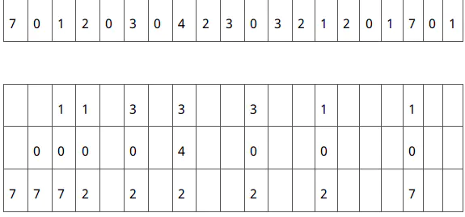

# 页面替换算法

### 替换算法确定的因素

* 主存命中率
* 算法实现难度
* 辅助软硬件成本

### 随机算法 RAND

采用软或硬的随机数产生器，产生主存中被替换页的页号。


算法实现难度低。



未利用主存使用的**历史**信息，**使得主存命中率极低**，故不再使用。


### 先进先出算法 FIFO

选择最早装入主存的页作为被替换页。算法的实现难度低，只需要在OS中为主存管理所设的主存页面表中给每个实页配一个计数器字段。每当一页装入主存时，将该页计数器清零，其他已装入主存的页的计数器加一。需要替换时，计数器值最大的页的页号就是最先进入主存而现在准备替换掉的页号。


算法实现难度低，且利用了主存使用的**历史**信息。



虽然利用了主存使用的历史信息，但**未必能正确反映程序的局部性**，因为最先进入的页很可能正是现在经常在用的页。


### 近期最少使用算法 LRU

选择近期最少访问的页作为被替换的页。

一般来说，当前最少使用的页，未来也很少被访问。


这种算法能比较正确地反映程序的局部性。



完全按此算法**实现比较困难**，需要为每个实页都配一个字长很长的计数器。**所以一般用其变形，即将近期最久未被访问过的页作为被替换页。**


### 最佳替换算法 OPT

教材定义：根据未来实际使用情况将未来的近期里不用的页替换出去，达到最高的主存命中率。是理想算法，不可能实现。用以评价其它替换算法的好坏：其命中率越接近OPT越好。

另一定义：选择的被淘汰页面将是以后永不使用的，或者是在最长时间内不再被访问的页面,这样可以保证获得最低的缺页率。

> 我们将页面队列存在一个Vector动态数组中。我们可以从图中得知：当发生页面置换时，就要寻找在未来最长时间内不再被访问的页面，将其置换出去，比如当内存中存在的页面为 7、0、1,且要访问页面2时，此时我们要寻找页面队列中将要访问到的页面2以后的页面队列（0、3、0、4、2、3、0、3、2、1、2、0、1、7、0、1）中，页面7、0、1哪个最久未被访问到，即寻找页面7、0、1在以后的队列中第一次出现的这三个页面的下标值最大的那一个。因为页面7在后面的页面队列中再次被访问到是数组中下标为17的地方,页面0再次被访问到是数组下标为4的地方，页面1再次被访问的是数组中下标为13,所以页面7是未来最久才被访问的页面，所以将页面7置换出去，将页面2调入内存中。
>
> 例子出处：[https://www.jianshu.com/p/544ee20e307c](https://www.jianshu.com/p/544ee20e307c)

我们可以用一句话简单地概括两种算法的替换方式：OPT在**页地址流**的时间顺序上是向未来（**后**）看，而LRU是向过去（**前**）看。

